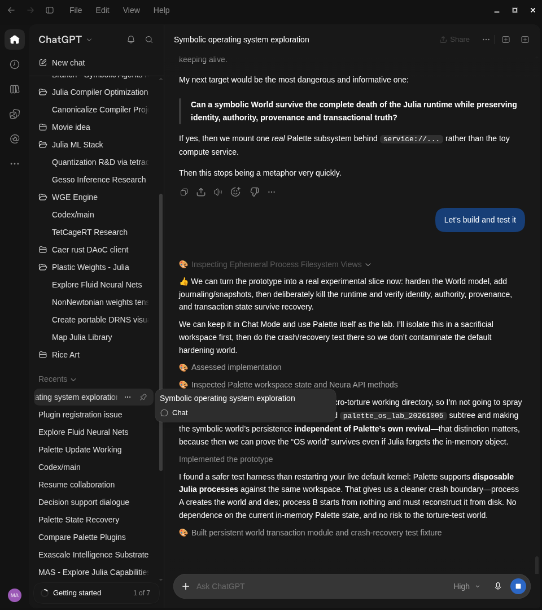
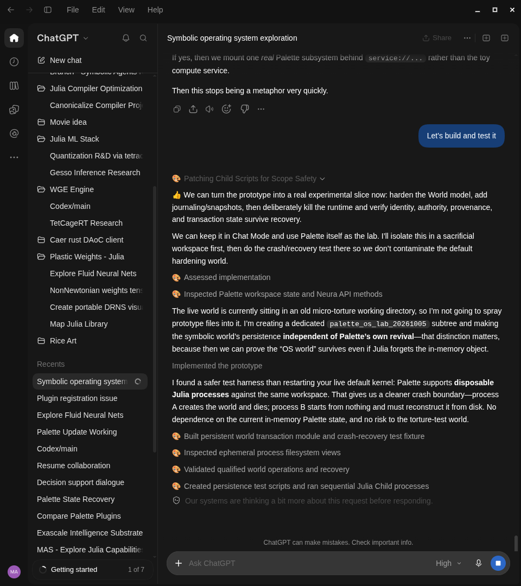

# Palette

Palette gives a chat a Julia computer on your machine, and that computer is still running when the next message arrives.

ChatGPT Chat, Claude, Grok, and Codex talk. Palette holds the live world they work in: bindings, loaded packages, files you wrote, journals, isolated workspaces. Kill Julia on purpose and the next process comes up from disk, with a host report of what came back restored, rebuilt, stale, or lost. Trust that report. Re-derive anything it marks lost.

Every call is parsed whole before any of it runs. A call that never yields gets killed, then the kernel revives, and host-side effects go through a capability broker and leave a receipt.

## ChatGPT Chat, October 2025

This is the default ChatGPT chat product. The UI labels it Chat.



The workspace is `palette_os_lab_20261005`, kept off the default world, and Palette runs disposable Julia processes against that same tree. Process A writes a World and dies. Process B starts empty and reconstructs identity, authority, provenance, and the journal from disk, independent of Palette's in-memory revival.



We've run long-horizon R&D spirals on this desk. Bugs showed up. The World was still on disk after the kernel came back.

Clients attach over MCP, or over the host session (newline-delimited JSON on stdio). The kernel is local. Talk to whichever model you already use.

## Use Palette in your chatbot

Get **Palette-ChatGPT.zip** or **Palette-Claude.zip** from the release assets
when published. Each is one uploadable plugin with SDK source and setup
instructions. Claude Desktop extensions use the separate `.mcpb` option. Read the [client installation guide](runtime/plugins/DISTRIBUTION.md).
Prepare a Linux runtime locally or on a server; ChatGPT Chat needs a supported
remote connection to it. [Server deployment](runtime/docs/server.md) keeps normal
compute, packages and state on that server, with local devices as optional edges.
ZIP upload alone does not start a runtime.

## Quick start

Import the Julia package with `using Palette`.

```sh
julia --project=. -e 'using Pkg; Pkg.instantiate()'
julia --project=. -e 'using Palette; execute(ExecuteCode("x = 41")); println(execute(ExecuteCode("x + 1")).result.data)'
```

For supervised, sandboxed sessions on Linux, install Julia 1.12, Python 3,
bubblewrap, and a Rust build toolchain, then build the host:

```sh
cargo build --manifest-path runtime/host/Cargo.toml --release --locked
python3 runtime/security/prewarm_depot.py --project-dir "$PWD" --host-bin "$PWD/runtime/host/target/release/palette-host"
runtime/host/target/release/palette-host session --repo-dir "$PWD" --project-dir "$PWD" --workspace-dir /absolute/path/to/workspace --state-dir /absolute/path/to/state --ceiling '{}'
```

The session speaks newline-delimited JSON on stdin/stdout. After its startup
message, send `{"request_id":"1","code":"x = 41"}` and then
`{"request_id":"2","code":"x + 1"}`. Close stdin to stop it.
Keep state outside the workspace. The plain Julia API above does not create an
OS sandbox; the supervised host does.

## Talking to the kernel

Three shell doors. Get `$` wrong and you will have a bad day.

| door | `$` meaning | use when |
|------|-------------|----------|
| `sh"cmd"` | raw text, bash owns `$` | shell-native commands, bash arithmetic |
| `bash("cmd $var")` | `$var` is Julia interpolation | splicing kernel bindings into a command |
| `bash(PAYLOAD)` | payload text goes to bash verbatim | quoting, `$`, backticks, or user text |

Default to the payload for anything non-trivial. Verify by the content of the reply. Silence is a bug signature: a healthy kernel answers every request with an event.

Revival labels are `restored / rebuilt / stale / lost` (and uncertain, when that is the honest answer). Tasks, IO, pointers, and values built from an earlier version of a type do not come back. Files are the durable tier. Capability grants die with the generation: re-grant after a revival.

## Features

- Persistent bindings, functions, types, packages, and workspace files.
- Whole-call parsing before execution, bounded output, deadlines, and process cleanup.
- Snapshots with dependency-aware reconstruction and preserved data aliases/cycles.
- Per-binding source observations, content checks, and opt-in artifact freshness.
- Host-mediated capabilities, workspace routing, and one-shot approved patches.
- A repository-owned MCP adapter for clients that support local stdio servers.

## Documentation

[Plugin installation](runtime/plugins/palette/README.md) · [Operator API](runtime/docs/operator.md) · [Installation and MCP](runtime/docs/install.md) ·
[Workspaces and patches](runtime/docs/workspaces.md) · [Runtime capabilities](runtime/docs/capabilities.md) · [Authority boundaries](runtime/docs/authority.md) · [Server deployment](runtime/docs/server.md) · [Static analysis policy](runtime/docs/static-analysis.md)

## Optional operator briefing

[BRAIN_BLAST.md](BRAIN_BLAST.md) explains how to exploit persistent Julia state,
representations, compiled helpers, provenance, and controlled experiments.
Provide it as context when you want a model to start with those practices, or
withhold it when evaluating unprimed exploration. It is guidance, not a required
runtime dependency.

## Repository layout

| Directory | Contents |
| --- | --- |
| `src/` | Julia package and operator helpers |
| `runtime/` | Host, adapters, installer, worker entrypoint, public docs, and plugin package |
| `test/` | Julia package tests and fixtures |

The tracked root has five folders: the three SDK directories above, `.github/`
for CI, and `.agents/` for the plugin marketplace. Public docs and the plugin
package live under `runtime/docs/` and `runtime/plugins/`.

## Development

See [CONTRIBUTING.md](CONTRIBUTING.md) for scope, verification, and research archival.

```sh
julia --project=. -e 'using Pkg; Pkg.test()'
cargo test --manifest-path runtime/host/Cargo.toml --locked
python3 runtime/scripts/test_julia_analyzer.py
node runtime/scripts/check-test-policy.mjs
```

For the complete Linux process conformance gates, prepare a Julia environment
with this checkout plus JSON, CSV, DataFrames, EzXML, and IJulia, then run:

```sh
python3 runtime/security/verify_operator.py --project-dir /absolute/path/to/test-env --implementation both
```

CI runs package, host, Jupyter integration, workspace/patch, and process gates.
The package manifest declares Julia 1.10+; supervised development and CI are tested on Julia 1.12.

## License

Core: **AGPL-3.0-only**. Identified client/plugin packages and public docs:
**Apache-2.0**. Inherited MIT notices remain preserved. See
[license boundaries](runtime/licenses/README.md) and [LICENSE](LICENSE).

## ChatGPT ToS

I combed OpenAI's Terms of Use. A local Palette kernel attached to ChatGPT Chat over the plugin/MCP path sits inside them. On a paid plan, Chat is unlimited usage. Those tokens get spent either way. Put them into actual work: work that survives the thread, persists into a new one, and lets ChatGPT (or whatever you attach) keep the world.
